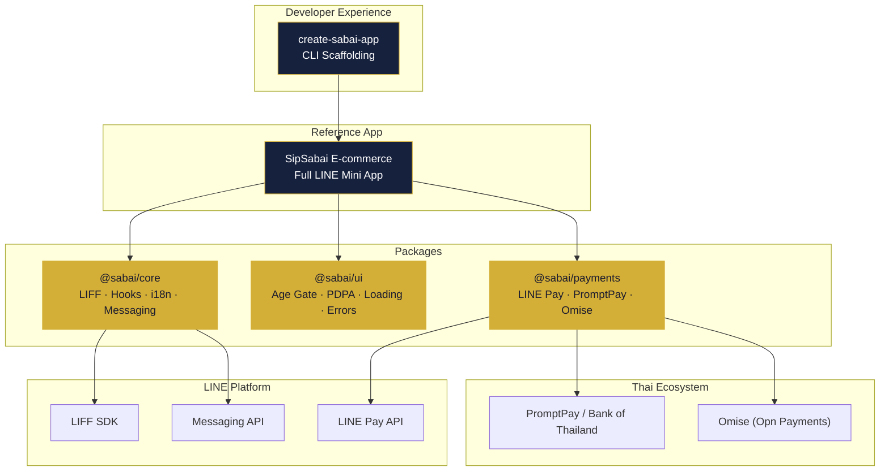

<div align="center">

# 🌴 Sabai Framework

### เฟรมเวิร์กสำหรับสร้าง LINE Mini App ในประเทศไทย

**The open-source framework for building LINE Mini Apps in Thailand**

[](https://www.typescriptlang.org/)
[](https://react.dev/)
[](./LICENSE)
[](https://nodejs.org/)
[](https://pnpm.io/)
[](https://turbo.build/)
[](./CONTRIBUTING.md)

---

*สบาย (Sabai)* — Thai for "comfortable, at ease." Build LINE Mini Apps สบายๆ.

[Quick Start](#-quick-start) · [Packages](#-packages) · [Documentation](#-documentation) · [Contributing](#-contributing)

</div>

---

## ✨ Features

- 🟢 **LIFF SDK Integration** — Initialisation with retry logic, deduplication, React hooks
- 🇹🇭 **Thai Compliance Built-in** — Age verification (Thai alcohol law), PDPA consent management
- 💳 **Thai Payment Methods** — LINE Pay v3, PromptPay QR (EMVCo), Omise gateway
- 🌏 **Bilingual i18n** — Thai/English with LINE language auto-detection
- 📱 **LINE Messaging** — Share Target Picker, Flex Message builders, push messaging
- ⚡ **Modern Stack** — React 19, TypeScript 5.8, Vite, Vitest, Turborepo
- 🎨 **Zero-dependency UI** — Inline-styled components with dark theme — no CSS imports needed
- 🛠️ **CLI Scaffolding** — `npx create-sabai-app` with project templates
- 🏪 **Reference App** — Full e-commerce LINE Mini App (SipSabai)

---

## 🚀 Quick Start

```bash
npx create-sabai-app my-app --template blank --liff-id placeholder
cd my-app
pnpm dev
```

That's it! You'll have a running LINE Mini App with mock mode enabled for local development.

> 💡 Replace `placeholder` with your real LIFF ID from the [LINE Developers Console](https://developers.line.biz/) when you're ready to deploy.

---

## 📦 Packages

| Package | Description | Version |
|---------|-------------|---------|
| [`@sabai/core`](./packages/core) | LIFF initialisation, React hooks, i18n, messaging |  |
| [`@sabai/ui`](./packages/ui) | Thai compliance UI components (age gate, PDPA consent) |  |
| [`@sabai/payments`](./packages/payments) | LINE Pay v3, PromptPay QR, Omise integration |  |
| [`create-sabai-app`](./packages/cli) | CLI scaffolding tool with project templates |  |

### Apps

| App | Description |
|-----|-------------|
| [`@sabai/e-commerce`](./apps/e-commerce) | **SipSabai** — Reference e-commerce LINE Mini App |

---

## 🏗️ Architecture



---

## 📋 Prerequisites

| Requirement | Version | Notes |
|-------------|---------|-------|
| **Node.js** | ≥ 18 | LTS recommended |
| **pnpm** | ≥ 9 | `npm install -g pnpm` |
| **LINE Developer Account** | — | [developers.line.biz](https://developers.line.biz/) |
| **LIFF App** | — | Created in the LINE Developers Console |

---

## 📥 Installation

### Start a new project (recommended)

```bash
npx create-sabai-app my-app
```

### Add to an existing project

```bash
# Core LIFF functionality
pnpm add @sabai/core

# Thai compliance UI components
pnpm add @sabai/ui

# Payment integrations
pnpm add @sabai/payments
```

---

## 🧑‍💻 Development (Monorepo)

```bash
# Clone and install
git clone https://github.com/web3guru888/sabai.git
cd sabai
pnpm install

# Build all packages
pnpm build

# Run dev servers (all packages + apps)
pnpm dev

# Run all tests
pnpm test

# Lint all packages
pnpm lint

# Format code
pnpm format
```

### Development Commands

| Command | Description |
|---------|-------------|
| `pnpm dev` | Start all dev servers in parallel |
| `pnpm build` | Build all packages with Turborepo |
| `pnpm test` | Run all test suites with Vitest |
| `pnpm lint` | Lint all packages with ESLint |
| `pnpm format` | Format code with Prettier |
| `pnpm clean` | Remove all `dist/` and `node_modules/` |

---

## 📂 Project Structure

```
sabai/
├── packages/
│   ├── core/               # @sabai/core — LIFF, hooks, i18n, messaging
│   │   ├── src/
│   │   │   ├── liff.ts         # LIFF SDK init with retry + deduplication
│   │   │   ├── hooks.ts        # useLiff() React hook
│   │   │   ├── env.ts          # Runtime environment configuration
│   │   │   ├── i18n.ts         # i18next setup with LINE language detection
│   │   │   ├── messaging.ts    # Share Target Picker, push, Flex builders
│   │   │   └── types.ts        # TypeScript interfaces
│   │   └── __tests__/
│   │
│   ├── ui/                 # @sabai/ui — Thai compliance components
│   │   ├── src/
│   │   │   ├── AgeVerification.tsx   # Thai alcohol law age gate
│   │   │   ├── PdpaConsent.tsx       # PDPA consent bottom sheet
│   │   │   ├── Loading.tsx           # Animated loading overlay
│   │   │   ├── ErrorDisplay.tsx      # Error screen with retry
│   │   │   ├── ErrorBoundary.tsx     # React error boundary
│   │   │   └── types.ts
│   │   └── __tests__/
│   │
│   ├── payments/           # @sabai/payments — Thai payment integrations
│   │   ├── src/
│   │   │   ├── linepay.ts      # LINE Pay v3 API client (server-side)
│   │   │   ├── promptpay.ts    # PromptPay QR generator (EMVCo)
│   │   │   ├── omise.ts        # Omise/Opn payment client
│   │   │   ├── utils.ts        # CRC16, TLV encoding, phone formatting
│   │   │   └── types.ts
│   │   └── __tests__/
│   │
│   └── cli/                # create-sabai-app — CLI scaffolding
│       └── src/
│           └── index.ts        # Interactive CLI with templates
│
├── apps/
│   └── e-commerce/         # SipSabai — Reference e-commerce app
│       └── src/
│           ├── App.tsx         # Main app with compliance gates
│           ├── pages/          # Home, Product, Cart, Checkout, etc.
│           ├── components/     # Layout, Nav, ProductCard, etc.
│           ├── stores/         # Zustand state management
│           ├── i18n/           # Thai/English translations
│           └── data/           # Product catalogue
│
├── docs/                   # Documentation
│   ├── getting-started.md
│   ├── architecture.md
│   ├── thai-compliance.md
│   └── deployment.md
│
├── CONTRIBUTING.md         # Contributing guidelines
├── CHANGELOG.md            # Release changelog
├── LICENSE                 # MIT License
├── turbo.json              # Turborepo configuration
├── pnpm-workspace.yaml     # pnpm workspace definition
└── tsconfig.base.json      # Shared TypeScript config
```

---

## 📚 Documentation

| Document | Description |
|----------|-------------|
| [Getting Started](./docs/getting-started.md) | Step-by-step setup guide |
| [Architecture](./docs/architecture.md) | Monorepo structure and design decisions |
| [Thai Compliance](./docs/thai-compliance.md) | Age verification, PDPA, and time-based restrictions |
| [Deployment](./docs/deployment.md) | Deploy to Cloudflare Pages, Vercel, or AWS |
| [Contributing](./CONTRIBUTING.md) | How to contribute to Sabai |
| [Changelog](./CHANGELOG.md) | Release history |

### Package Documentation

| Package | README |
|---------|--------|
| @sabai/core | [packages/core/README.md](./packages/core/README.md) |
| @sabai/ui | [packages/ui/README.md](./packages/ui/README.md) |
| @sabai/payments | [packages/payments/README.md](./packages/payments/README.md) |
| create-sabai-app | [packages/cli/README.md](./packages/cli/README.md) |

---

## 🤝 Contributing

We welcome contributions! See our [Contributing Guide](./CONTRIBUTING.md) for details.

```bash
# Fork → clone → branch → code → test → PR
git checkout -b feature/my-feature
pnpm test
git commit -m "feat: add amazing feature"
```

---

## 📄 License

[MIT](./LICENSE) © 2024–2026 Sabai Framework Contributors

---

<div align="center">

**Built with ❤️ for the Thai developer community**

สร้างด้วย ❤️ เพื่อชุมชนนักพัฒนาไทย

🌴 *สบาย~*

</div>
