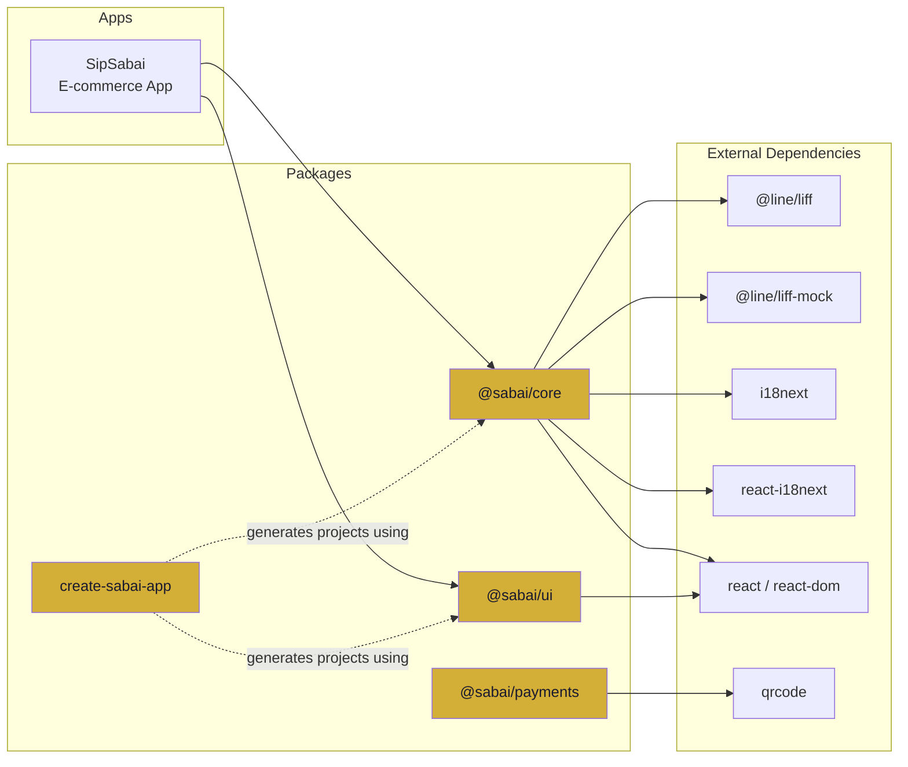
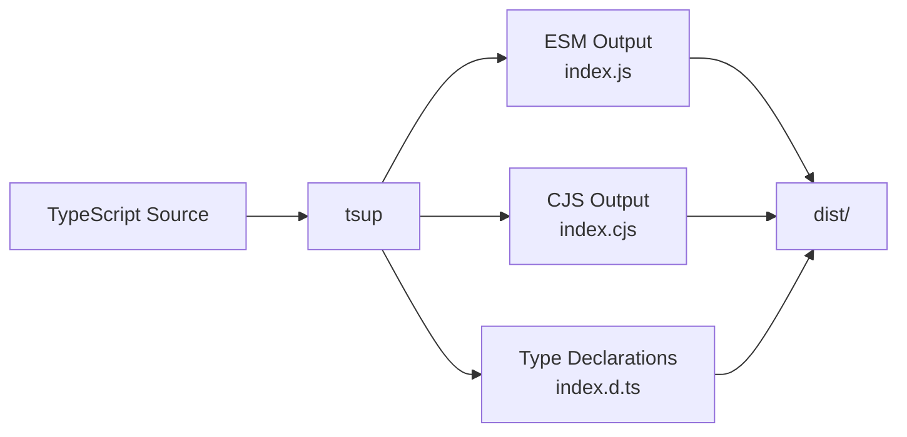

# Architecture / สถาปัตยกรรม

This document describes the Sabai Framework's monorepo structure, package dependencies, build pipeline, and technology choices.

---

## Monorepo Structure / โครงสร้าง Monorepo

Sabai uses a **pnpm workspace + Turborepo** monorepo. All packages and apps live in a single repository and are built, tested, and linted together.

```
sabai/
├── packages/         # Published npm packages
│   ├── core/         # @sabai/core
│   ├── ui/           # @sabai/ui
│   ├── payments/     # @sabai/payments
│   └── cli/          # create-sabai-app
├── apps/             # Reference applications (not published)
│   └── e-commerce/   # SipSabai reference app
├── pnpm-workspace.yaml
├── turbo.json
└── tsconfig.base.json
```

### Why a monorepo?

| Benefit | How Sabai uses it |
|---------|------------------|
| **Shared config** | TypeScript, ESLint, Prettier configs shared across packages |
| **Atomic changes** | A single PR can update core + UI + tests together |
| **Consistent versions** | All packages released and tested in sync |
| **Dev experience** | `pnpm dev` starts everything; `pnpm test` tests everything |
| **Dependency management** | pnpm's strict node_modules prevents phantom dependencies |

---

## Package Dependency Graph / กราฟการพึ่งพาแพ็คเกจ



### Key design decisions:

- **`@sabai/core`** is the only package that depends on `@line/liff`. Other packages don't import LIFF directly.
- **`@sabai/ui`** has zero runtime dependencies beyond React. All styles are inline.
- **`@sabai/payments`** is independent — it doesn't depend on `@sabai/core` or `@sabai/ui`.
- **`create-sabai-app`** is a standalone CLI. It doesn't import other packages at runtime — it copies templates.

---

## Build Pipeline / กระบวนการ Build



### Tools

| Tool | Purpose |
|------|---------|
| **[tsup](https://tsup.egoist.dev/)** | Bundle packages to ESM + CJS + DTS |
| **[Turborepo](https://turbo.build/)** | Orchestrate builds, cache artifacts, parallel execution |
| **[Vite](https://vitejs.dev/)** | Dev server and build tool for apps (e-commerce) |
| **[Vitest](https://vitest.dev/)** | Test runner (compatible with Vite transforms) |
| **[ESLint](https://eslint.org/)** | Code linting with TypeScript plugin |
| **[Prettier](https://prettier.io/)** | Code formatting |

### Build Order (Turborepo)

Turborepo automatically determines the build order from package dependencies:

1. `@sabai/core` (no internal dependencies)
2. `@sabai/ui` (no internal dependencies)
3. `@sabai/payments` (no internal dependencies)
4. `create-sabai-app` (no internal dependencies)
5. `@sabai/e-commerce` (depends on core + ui)

All non-dependent packages build in parallel.

---

## Technology Choices and Rationale / เทคโนโลยีที่เลือกและเหตุผล

### TypeScript 5.8

- **Why:** Type safety across the entire stack. Catches errors at compile time.
- **Config:** Strict mode enabled. `tsconfig.base.json` shared across packages.

### React 19

- **Why:** The dominant UI framework for LINE Mini Apps. Most Thai developers are familiar with React.
- **How:** Used in `@sabai/core` (hooks), `@sabai/ui` (components), and the reference app.

### Vite

- **Why:** Fastest dev server with HMR. Native ESM support. Excellent for LINE Mini Apps where fast load times matter on mobile.
- **How:** Used for the reference e-commerce app. CLI templates ship Vite configs.

### pnpm

- **Why:** Strict `node_modules` structure prevents phantom dependencies. Faster than npm/yarn for monorepos. Workspace protocol for local package linking.
- **How:** `pnpm-workspace.yaml` defines the workspace. All commands run through pnpm.

### tsup

- **Why:** Zero-config TypeScript bundler. Outputs ESM + CJS + DTS simultaneously. Uses esbuild internally for speed.
- **How:** Each package has a `tsup.config.ts` that bundles `src/index.ts` → `dist/`.

### Vitest

- **Why:** Compatible with Vite's transform pipeline. Fast, native TypeScript support. Jest-compatible API (easy migration).
- **How:** Each package has a `vitest.config.ts`. Tests live in `__tests__/` directories.

### Inline Styles (UI components)

- **Why:**
  1. Zero CSS configuration needed
  2. No class name conflicts with the host app
  3. Works in any React project without build tool changes
  4. Minimal payload — no separate CSS file to load
- **Trade-off:** No pseudo-selectors (`:hover`, `:focus`) in inline styles — the CSS keyframe for the spinner is injected via a `<style>` tag.

---

## Package Formats / รูปแบบแพ็คเกจ

All packages ship dual ESM + CJS format with TypeScript declarations:

| Output | Extension | Used by |
|--------|-----------|---------|
| ESM | `.js` | Modern bundlers (Vite, webpack 5, Rollup) |
| CJS | `.cjs` | Node.js `require()`, older bundlers |
| Types | `.d.ts` | TypeScript consumers |

Package.json `exports` field ensures the correct format is resolved:

```json
{
  "main": "./dist/index.cjs",
  "module": "./dist/index.js",
  "types": "./dist/index.d.ts",
  "exports": {
    ".": {
      "import": "./dist/index.js",
      "require": "./dist/index.cjs",
      "types": "./dist/index.d.ts"
    }
  }
}
```

---

## Testing Architecture / สถาปัตยกรรมการทดสอบ

```
packages/core/__tests__/
├── liff.test.ts        # LIFF init, retry, deduplication
├── hooks.test.tsx      # useLiff React hook
├── env.test.ts         # Environment configuration
├── i18n.test.ts        # i18next setup, language detection
└── messaging.test.ts   # Share, push, Flex builders

packages/ui/__tests__/
├── AgeVerification.test.tsx
├── PdpaConsent.test.tsx
├── Loading.test.tsx
├── ErrorDisplay.test.tsx
└── ErrorBoundary.test.tsx

packages/payments/__tests__/
├── linepay.test.ts
├── promptpay.test.ts
├── omise.test.ts
└── utils.test.ts

apps/e-commerce/__tests__/
└── stores/
    ├── app.test.ts
    ├── cart.test.ts
    └── orders.test.ts
```

- **Unit tests** for all pure functions and utilities
- **React Testing Library** for component tests
- **Mock-based** LIFF tests (no real LINE backend needed)
- **Vitest** as the test runner with jsdom environment for browser APIs

---

## Next Steps / ขั้นตอนถัดไป

- [Getting Started](./getting-started.md) — Set up your first project
- [Thai Compliance](./thai-compliance.md) — Legal requirements and how Sabai handles them
- [Deployment](./deployment.md) — Ship to production
