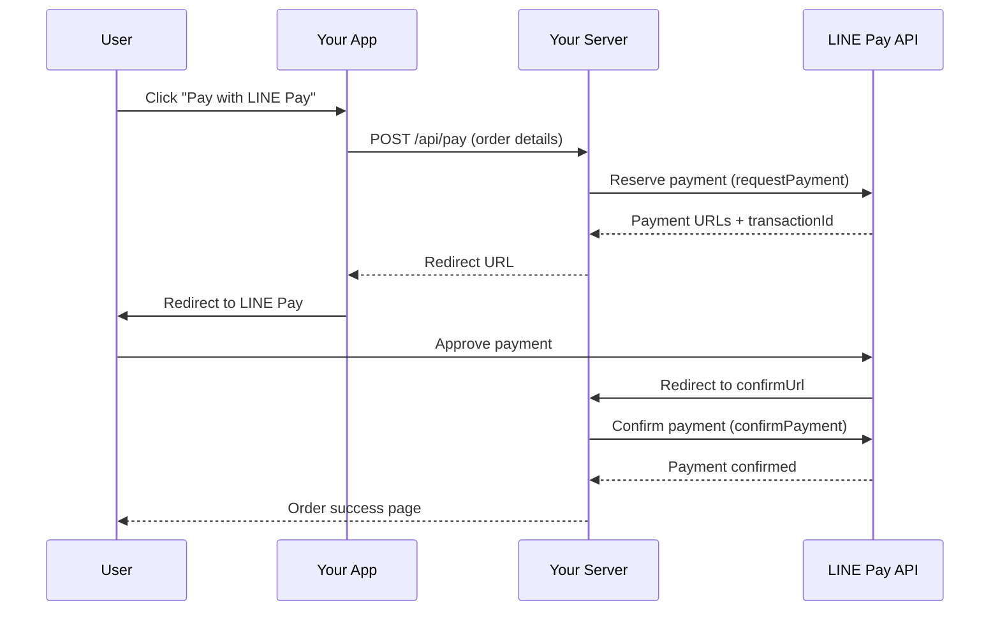

# @sabai/payments

> Payment integrations for Thailand — LINE Pay v3, PromptPay QR, and Omise.
>
> ระบบชำระเงินสำหรับประเทศไทย — LINE Pay v3, PromptPay QR และ Omise

[](https://www.typescriptlang.org/)
[](../../LICENSE)

---

## Installation / การติดตั้ง

```bash
pnpm add @sabai/payments
```

---

## Overview / ภาพรวม

| Method | Type | Use Case |
|--------|------|----------|
| **LINE Pay v3** | Server-side | Credit/debit card, LINE Pay wallet |
| **PromptPay QR** | Client-safe | Bank transfer via QR code |
| **Omise** | Server-side | Cards, TrueMoney, internet banking |

---

## 1. LINE Pay v3 / ไลน์เพย์

Full LINE Pay v3 API client with HMAC-SHA256 signing, sandbox support, and the complete Reserve → Confirm payment lifecycle.

> ⚠️ **Server-side only** — uses `node:crypto` for request signing. Never expose your channel secret to client code.

### Setup

```ts
import { LinePayClient } from '@sabai/payments';

const linePay = new LinePayClient({
  channelId: process.env.LINEPAY_CHANNEL_ID!,
  channelSecret: process.env.LINEPAY_CHANNEL_SECRET!,
  sandbox: true, // Use sandbox for testing
});
```

### Payment Flow / ขั้นตอนการชำระเงิน



### Step 1: Reserve a Payment

```ts
const response = await linePay.requestPayment({
  amount: 350,
  currency: 'THB',
  orderId: 'order-001',
  packages: [
    {
      id: 'pkg-1',
      amount: 350,
      products: [
        { name: 'Pad Thai', quantity: 1, price: 200 },
        { name: 'Thai Iced Tea', quantity: 1, price: 150 },
      ],
    },
  ],
  redirectUrls: {
    confirmUrl: 'https://your-app.com/pay/confirm',
    cancelUrl: 'https://your-app.com/pay/cancel',
  },
});

if (response.returnCode === '0000') {
  // Redirect user to LINE Pay
  const paymentUrl = response.info!.paymentUrl.web;
  const transactionId = response.info!.transactionId;
  // Store transactionId for confirmation step
}
```

### Step 2: Confirm the Payment

```ts
// Called when LINE Pay redirects to your confirmUrl
const confirmation = await linePay.confirmPayment(transactionId, {
  amount: 350,
  currency: 'THB',
});

if (confirmation.returnCode === '0000') {
  // Payment successful!
  console.log('Order ID:', confirmation.info!.orderId);
  console.log('Payment methods:', confirmation.info!.payInfo);
}
```

### Step 3: Check Payment Status (optional)

```ts
const details = await linePay.getPaymentDetails(transactionId);
console.log('Status:', details.returnCode);
```

### API Reference

| Method | Description |
|--------|-------------|
| `requestPayment(body)` | Reserve a new payment. Returns payment URLs and transaction ID. |
| `confirmPayment(transactionId, body)` | Confirm a payment after user approval. |
| `getPaymentDetails(transactionId)` | Query the status of a transaction. |

### `LinePayConfig`

| Property | Type | Default | Description |
|----------|------|---------|-------------|
| `channelId` | `string` | **required** | LINE Pay channel ID |
| `channelSecret` | `string` | **required** | LINE Pay channel secret |
| `sandbox` | `boolean` | `false` | Use sandbox endpoint |

---

## 2. PromptPay QR / พร้อมเพย์ QR

Generate EMVCo-compliant PromptPay QR codes for Thai bank transfers. Works on both client and server.

> ✅ **Client-safe** — No secrets needed. The QR code encodes only the recipient's phone number or national ID and the amount.

### Generate QR Code

```tsx
import { generatePromptPayQR } from '@sabai/payments';

// Dynamic QR (fixed amount)
const { payload, qrDataUrl } = await generatePromptPayQR({
  target: '0812345678',  // Thai phone number
  amount: 150.50,
});

// Display in React
function PaymentQR() {
  return (
    <div>
      
      <p>฿150.50</p>
    </div>
  );
}
```

### Static QR (any amount)

```ts
import { generatePromptPayQR } from '@sabai/payments';

// Static QR — payer enters the amount themselves
const { qrDataUrl } = await generatePromptPayQR({
  target: '0812345678',
});
```

### Using National ID

```ts
const { qrDataUrl } = await generatePromptPayQR({
  target: '1234567890123',  // 13-digit Thai national ID
  amount: 99.00,
});
```

### Payload Only (no QR image)

```ts
import { generatePromptPayPayload } from '@sabai/payments';

const payload = generatePromptPayPayload({
  target: '0812345678',
  amount: 250.00,
});

console.log(payload);
// EMVCo TLV string: "00020101021229370016A00000067701011101130066812345678..."
```

### QR Options

```ts
const { qrDataUrl } = await generatePromptPayQR(
  { target: '0812345678', amount: 100 },
  {
    width: 400,   // Image width in pixels (default: 300)
    margin: 4,    // Quiet zone margin in modules (default: 2)
  },
);
```

### EMVCo Payload Structure

The generated payload follows the EMVCo Merchant-Presented QR specification:

| Tag | Description | Value |
|-----|-------------|-------|
| `00` | Payload Format Indicator | `01` |
| `01` | Point of Initiation Method | `11` (static) or `12` (dynamic) |
| `29` | Merchant Account (PromptPay) | Sub-TLV: AID + target ID |
| `53` | Transaction Currency | `764` (THB per ISO 4217) |
| `54` | Transaction Amount | Amount string (dynamic QR only) |
| `58` | Country Code | `TH` |
| `63` | CRC16 Checksum | Computed over entire payload |

### `PromptPayConfig`

| Property | Type | Description |
|----------|------|-------------|
| `target` | `string` | Thai phone number (`0812345678`) or national ID (13 digits) |
| `amount` | `number?` | Amount in THB. Omit for static (any-amount) QR. |

### `PromptPayQRResult`

| Property | Type | Description |
|----------|------|-------------|
| `payload` | `string` | Raw EMVCo TLV payload string |
| `qrDataUrl` | `string` | PNG data URL for the QR code image |

---

## 3. Omise (Opn Payments) / โอมิเซะ

Payment gateway client for Omise (now Opn Payments). Supports cards, TrueMoney Wallet, internet banking, and more.

> ⚠️ **Charge operations are server-side only** — require the Omise secret key.

### Setup

```ts
import { OmiseClient } from '@sabai/payments';

const omise = new OmiseClient({
  publicKey: process.env.OMISE_PUBLIC_KEY!,  // pkey_...
  secretKey: process.env.OMISE_SECRET_KEY!,  // skey_... (server-side only)
});
```

### Create a Charge

```ts
const charge = await omise.createCharge({
  amount: 10000,     // 100.00 THB (in satang)
  currency: 'thb',
  card: 'tokn_test_xxxxxxxxxxxx',  // Token from Omise.js
  description: 'Order #1234',
  metadata: {
    orderId: 'order-1234',
    customerId: 'cust-456',
  },
});

if (charge.paid) {
  console.log('Payment successful:', charge.id);
} else {
  console.log('Payment failed:', charge.failureMessage);
}
```

### Retrieve a Charge

```ts
const charge = await omise.getCharge('chrg_test_xxxxxxxxxxxx');
console.log('Status:', charge.status);
// "pending" | "successful" | "failed" | "expired" | "reversed"
```

### Client-side Token (with Omise.js)

Use the public key to create tokens on the client:

```ts
const publicKey = omise.getPublicKey(); // Safe for client-side
// Use with Omise.js for card tokenization
```

### API Reference

| Method | Description | Server-side? |
|--------|-------------|:------------:|
| `getPublicKey()` | Get the public key for Omise.js | ❌ |
| `createCharge(request)` | Create a new charge | ✅ |
| `getCharge(chargeId)` | Retrieve a charge by ID | ✅ |

### `OmiseConfig`

| Property | Type | Description |
|----------|------|-------------|
| `publicKey` | `string` | Omise public key (`pkey_...`) — safe for client |
| `secretKey` | `string?` | Omise secret key (`skey_...`) — server-side only |

### `OmiseChargeRequest`

| Property | Type | Description |
|----------|------|-------------|
| `amount` | `number` | Amount in smallest unit (satang: 10000 = ฿100) |
| `currency` | `string` | ISO 4217 code (e.g. `"thb"`) |
| `card` | `string?` | Token from Omise.js card tokenization |
| `source` | `string?` | Source ID for alternative payment methods |
| `description` | `string?` | Charge description |
| `metadata` | `Record<string, unknown>?` | Arbitrary key-value metadata |

---

## Utility Functions / ฟังก์ชันยูทิลิตี้

Exported helpers used internally and available for direct use:

| Function | Description |
|----------|-------------|
| `crc16(data)` | CRC16-CCITT checksum (EMVCo standard) |
| `tlv(tag, value)` | TLV (Tag-Length-Value) encoding |
| `formatPhoneForPromptPay(phone)` | Format Thai phone to PromptPay format (`0812345678` → `0066812345678`) |
| `isValidNationalId(id)` | Validate Thai national ID (13 digits) |

```ts
import { crc16, tlv, formatPhoneForPromptPay, isValidNationalId } from '@sabai/payments';

crc16('some data');                         // "A1B2"
tlv('00', '01');                            // "000201"
formatPhoneForPromptPay('0812345678');      // "0066812345678"
isValidNationalId('1234567890123');         // true
```

---

## Security Considerations / ข้อพิจารณาด้านความปลอดภัย

| Concern | Recommendation |
|---------|----------------|
| **LINE Pay secrets** | Store `channelSecret` in environment variables, server-side only |
| **Omise secret key** | Never expose `skey_...` to client code |
| **PromptPay targets** | Phone numbers/IDs are embedded in QR — no secrets involved |
| **Amount validation** | Always validate amounts server-side before confirming payments |
| **HTTPS** | All payment endpoints require HTTPS in production |
| **Idempotency** | Use unique `orderId` values to prevent duplicate charges |
| **Webhook verification** | Verify webhook signatures from LINE Pay and Omise |

---

## License / สัญญาอนุญาต

[MIT](../../LICENSE) © 2024–2026 Sabai Framework Contributors
